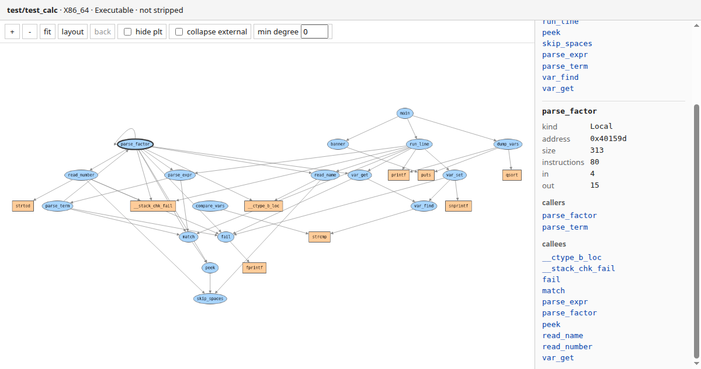

# binary2graph

binary2graph builds a static call graph from an x86-64 ELF binary. It reads the
symbol table, decodes every function body it can reach and records the direct
calls it finds, resolving PLT stubs back to the names of the imported functions.
It also prints a passport of the binary: compiler, dependencies, sanitizer
instrumentation and a hardening checklist.

## Build

`cargo build --release`, which puts the binary in `target/release/binary2graph`.

## Usage

```
Usage: binary2graph [OPTIONS] <BINARY>

Options:
  -o, --output <OUTPUT>  Where to write the DOT graph file [default: callgraph.dot]
      --no-info          Skip the binary info passport (print only graph and stats)
      --json <JSON>      Write full analysis as JSON to this path
      --serve <SERVE>    Serve results over HTTP on this port instead of writing files
```

```
gcc -no-pie -o test/test_target test/test_target.c
gcc -no-pie -o test/test_calc test/test_calc.c
binary2graph test/test_target
binary2graph test/test_calc --no-info -o app.dot --json app.json
binary2graph test/test_calc --serve 8080
```

The DOT file renders with graphviz: `dot -Tsvg callgraph.dot -o callgraph.svg`.

## Output

The passport comes first, then a function table sorted by incoming call count
(address, size, instructions, IN, OUT), then the totals:

```
=== test/test_target ===
Format:      Elf (64-bit, Little endian)
Arch:        X86_64
Kind:        Executable
Entry point: 0x401050
Interpreter: /lib64/ld-linux-x86-64.so.2
Compiler:    GCC: (Ubuntu 14.2.0-19ubuntu2) 14.2.0
Symbols:     present (.symtab)
Needed libs:
  libc.so.6
Instrumentation: none detected
Hardening:
  NX:      enabled
  RELRO:   partial
  Canary:  not found
  CET:     property note present
  Fortify: not found
  PIE:     no
[...]
Graph: 5 nodes, 5 edges
```

## Web UI

`--serve <port>` starts an HTTP server on `127.0.0.1` and keeps it in the
foreground; the DOT file is written as usual before it comes up. `/` is a single
page that fetches `/api/report` and draws the graph with cytoscape.js from a
CDN, so the browser needs network access. Local functions are blue ellipses, PLT
stubs orange rectangles, unresolved targets grey. Clicking a node highlights its
neighbourhood and fills the side panel with address, size, instruction count,
in/out counts and clickable caller and callee lists. `/api/report` serves the
same report that `--json` writes.



## What the passport reports

- Compiler strings from `.comment` and the `DT_NEEDED` libraries from `.dynamic`.
- Instrumentation: AddressSanitizer, ThreadSanitizer, MemorySanitizer,
  UBSanitizer, LeakSanitizer, SanitizerCoverage, libFuzzer, AFL and gcov/LLVM
  profiling, matched by symbol prefix and by linked runtime, with up to five
  matching symbols printed as evidence.
- Hardening: NX, RELRO (none, partial or full), a `__stack_chk_fail` canary, a
  CET property note, fortified libc calls (`__*_chk`) and PIE.
- Entry point, interpreter, whether symbols survived, and the section table.

## Limitations

- x86-64 ELF only. The decoder runs in 64-bit mode and PLT resolution looks for
  `R_X86_64_JUMP_SLOT` relocations.
- Only direct near calls become edges. Calls through a register or memory
  operand, and tail calls compiled to `jmp`, are not resolved.
- Function discovery needs `.symtab`. On a stripped binary the passport still
  works, but the function table and the graph come out empty.
- Functions of zero size, or with a body outside `.text`, are skipped.
- PLT names are read from `.plt.sec`, the layout produced with
  `-fcf-protection`. Without it, calls into the PLT stay as `sub_<address>` nodes.

## How it works

`object` parses the ELF and hands over symbols, sections and dynamic
relocations; `iced-x86` decodes each function body to count instructions and
collect call targets; `petgraph` holds the graph and emits the DOT; `serde_json`
serialises the full report, and `axum` serves it next to the embedded page.
